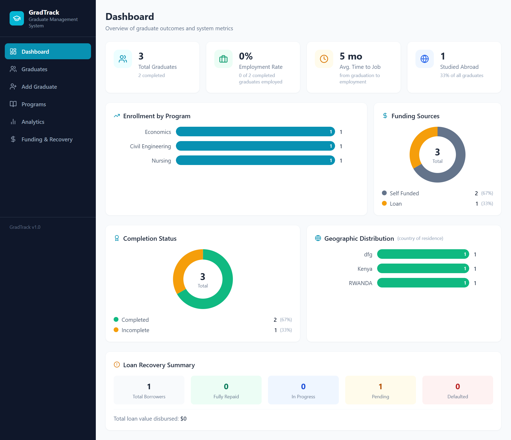
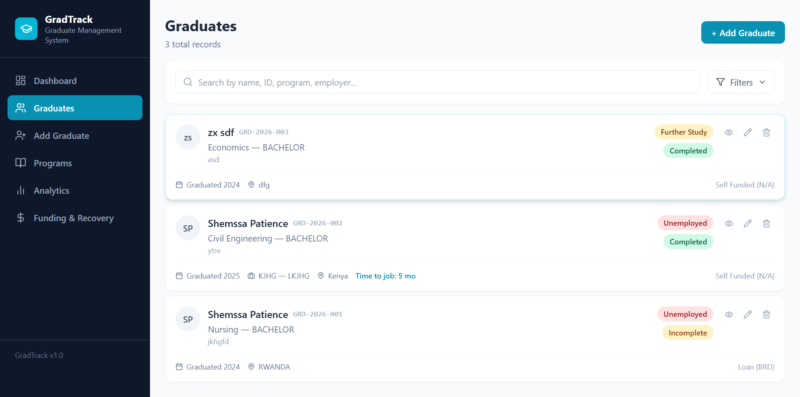
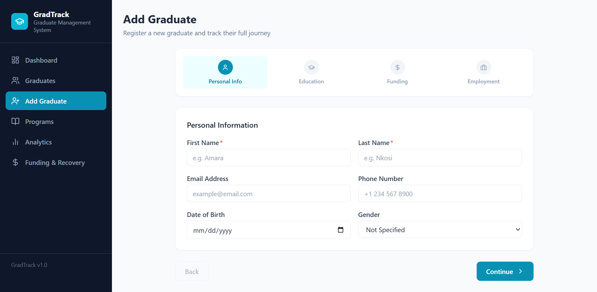
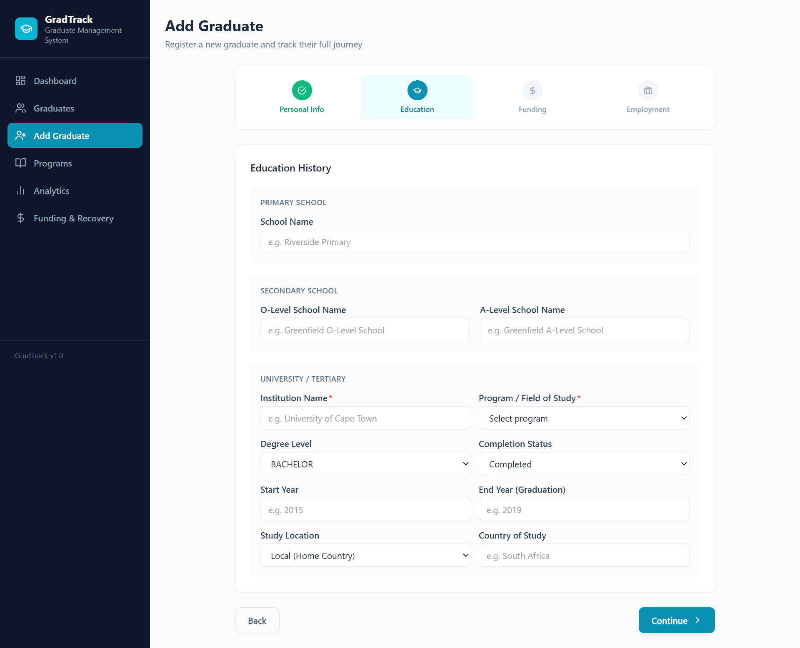
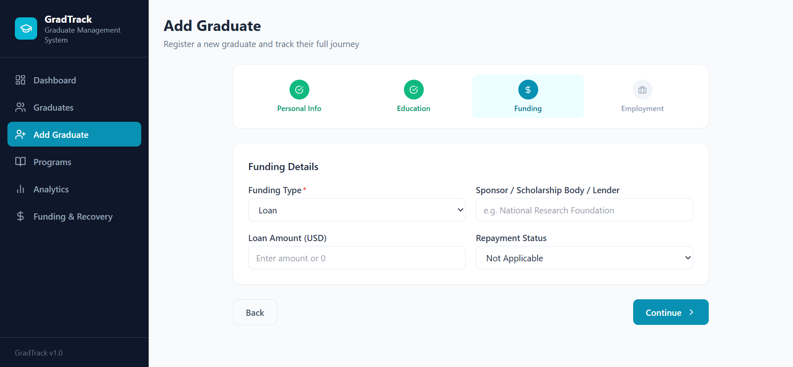
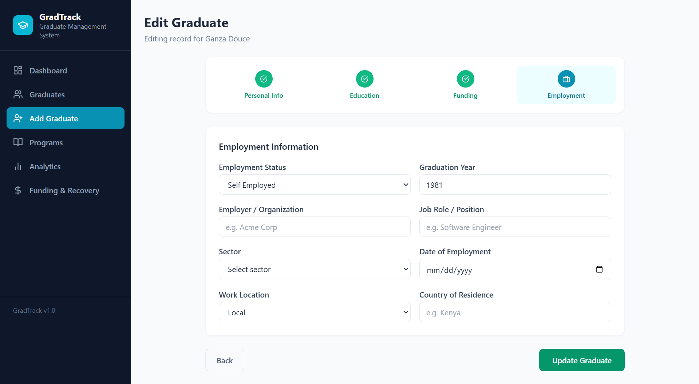
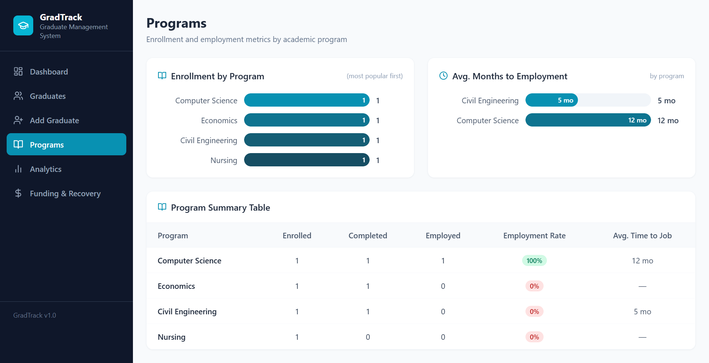
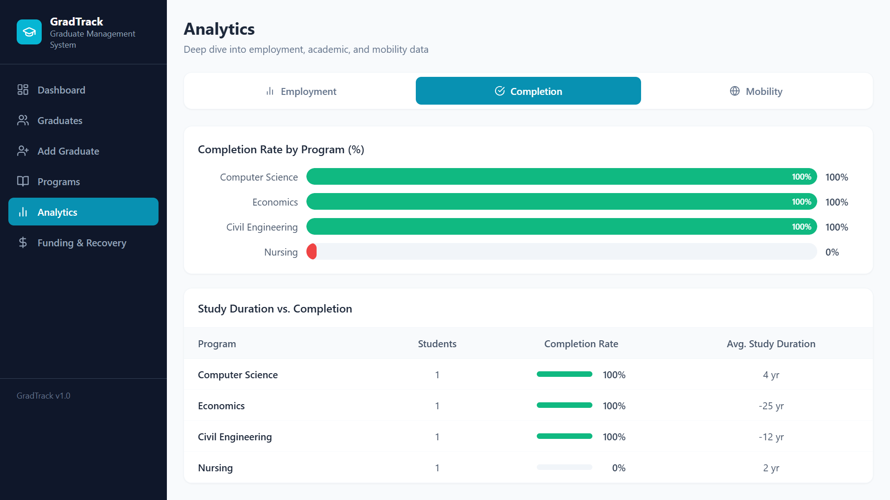
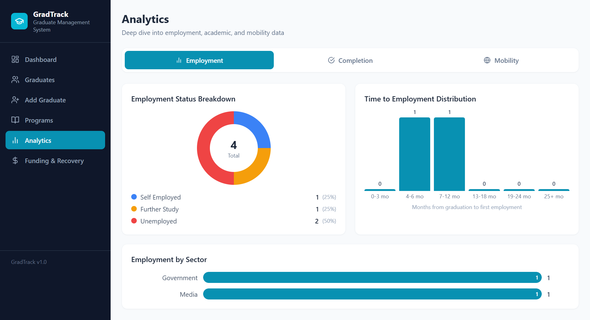
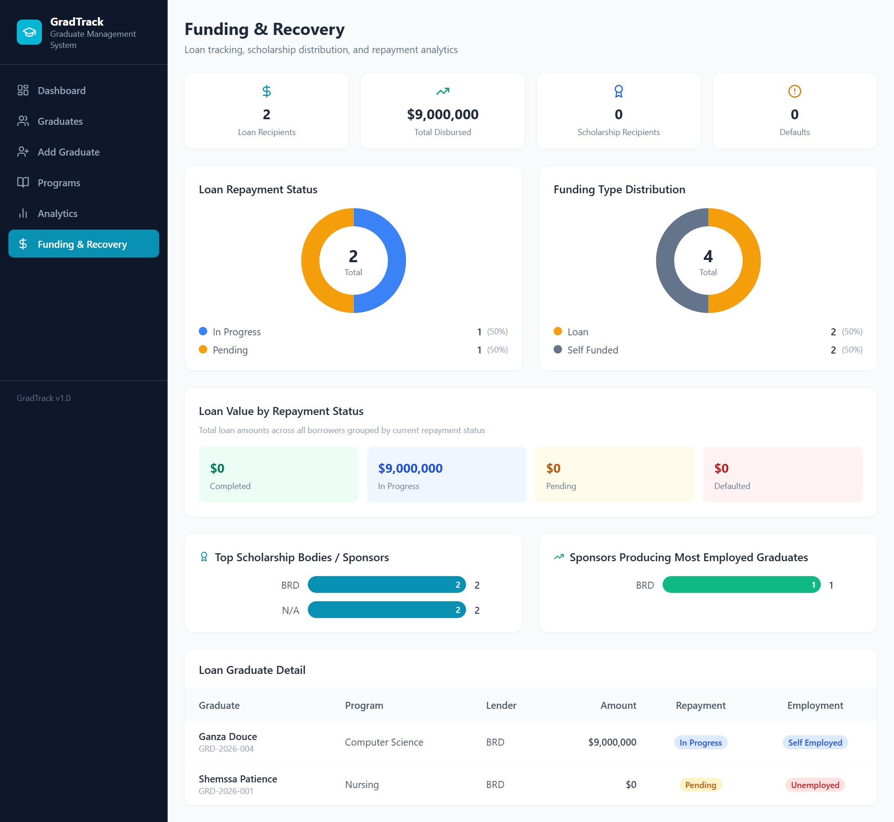

# GradTrack

GradTrack is a graduate management system for recording student journeys from school to university, employment, further study, and funding recovery. It helps track personal information, education history, employment outcomes, mobility, and loan repayment in one place.

## Architecture

- Frontend: React + TypeScript + Vite
- Backend: Node.js + Express
- ORM: Prisma
- Database: PostgreSQL / Supabase Postgres
- Authentication: JWT-based admin login for dashboard access

## Setup

1. Install dependencies:
   `npm install`
2. Copy `.env.example` values into your local environment.
3. Set `DATABASE_URL` to your Supabase Postgres connection string.
4. Set `VITE_API_URL` to your backend URL, for example `http://localhost:4000/api`.
5. Generate Prisma client:
   `npm run prisma:generate`
6. Push the Prisma schema to the database:
   `npm run prisma:push`
7. Create an admin user:
   `npm run admin:create -- admin@example.com your-password`
8. Start the backend:
   `npm run backend`
9. Start the frontend:
   `npm run dev`

## Security

- The dashboard is now protected and only accessible to authenticated admin users.
- Graduate CRUD now goes through the Node.js backend instead of the browser talking directly to the database.
- Prisma is used as the data-access layer between the backend and the database.
- You should still tighten database permissions and use a strong `JWT_SECRET` in production.

## How It Works

The system stores each graduate as a single record and follows their journey across different stages:

1. Add a graduate with personal, education, funding, and outcome details.
2. View all graduates in a searchable list.
3. Open a graduate record to review or edit it.
4. Use dashboards and analytics pages to understand outcomes, completion, mobility, and funding recovery.

## Pages

### Dashboard

The dashboard gives a quick overview of the whole system. It shows total graduates, employment rate, average time to job, study abroad count, funding sources, completion status, geographic distribution, and loan recovery summary.

### Graduates

The graduates page is the main records list. It lets users search, filter, view, edit, and delete graduate records while seeing key summary details for each person.

### Add Graduate

The add graduate flow is a step-by-step form used to register a new graduate and capture their full journey.

#### Personal Information

This section captures identity and contact information such as name, email, phone number, date of birth, and gender.

#### Education

This section records primary school, O-Level school, A-Level school, university details, degree level, completion status, and study location.

#### Funding

This section captures how the graduate was funded, including funding type, sponsor or lender, loan amount, and repayment status.

#### Employment and Further Study

This section records the graduate outcome after study. It supports employment details, unemployment status, or further study information such as country of study, field of study, graduation year, and funding source.

### Programs

The programs page groups graduates by academic program. It shows enrollment by program, average months to employment, and a summary table for completion and employment rates.

### Analytics

The analytics page provides deeper insight into graduate outcomes through three focused views.

#### Employment Analytics

This view shows employment status breakdown, time-to-employment distribution, and employment by sector.

#### Completion Analytics

This view shows completion rate by program and compares study duration against completion performance.

#### Mobility Analytics

This view shows study-abroad patterns, return-versus-stay-abroad outcomes, and the return rate for graduates who studied abroad. Return-home logic is based on comparing country of origin with country of residence only for graduates who studied abroad.

### Funding & Recovery

This page focuses on financial support and repayment tracking. It shows loan repayment status, funding distribution, sponsor performance, loan value by repayment stage, and borrower details.

## Notes

- Screenshots above are expected in `public/readme/`.
- Backend environment variables are documented in `.env.example`.
- Suggested file names:
  - `dashboard.png`
  - `graduate-list.png`
  - `addgraduate_personalInfo.png`
  - `add_education.png`
  - `add_funding.png`
  - `add_employment.png`
  - `programs.png`
  - `analytics_employment.png`
  - `analytics_completion.png`
  - `analytics.png`
  - `funding.png`
